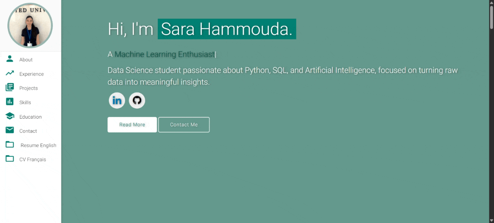

# Personal Portfolio ⚡️  
> A clean, beautiful, responsive portfolio template for Data Science & AI Enthusiasts!

> https://sarahammoudaa.github.io

<<<<<<< HEAD
=======

>>>>>>> main
### Website Preview  

  
  <kbd>  
      
  </kbd>  

⭐ Star this repo if you like it — it helps me a lot!

## Features 📋  
⚡️ Fully Responsive Design  
⚡️ Clean, Modern UI tailored for Data Science & AI portfolios  
⚡️ Typing animation using `Typed.js`  
⚡️ Easy customization and extendable structure  

## Installation & Deployment 📦  
- Clone this repo and update **index.html** and other assets to fit your projects and info.  
- Replace images in `assets/img/` as needed.  
- Recommended to deploy with [GitHub Pages](https://pages.github.com/) for a free, fast hosting solution.  
- To deploy, create a repo named `<sarahammoudaa>.github.io` and push your code to the `main` or `master` branch.  

## Sections Included 📚  
✔️ About Me  
✔️ Experience  
✔️ Projects  
✔️ Skills (Python, SQL, Machine Learning, etc.)  
✔️ Education  
✔️ Contact Information  
✔️ Resume Download  

## Tools & Libraries Used 🛠️  
* [GitHub Pages](https://pages.github.com/) - Static web hosting  
* [Materialize CSS](https://materializecss.com/) - Responsive UI framework  
* [Typed.js](https://mattboldt.com/demos/typed-js/) - Animated typing effect  

## How To Contribute 💡  
1. Fork this repository 🍴  
2. Clone to your local machine 👯‍♂️  
3. Make your improvements and commit changes 🔨  
4. Open a Pull Request 🔃  

## License 📄  
This project is licensed under the MIT License - see the [LICENSE](./LICENSE) file for details.
